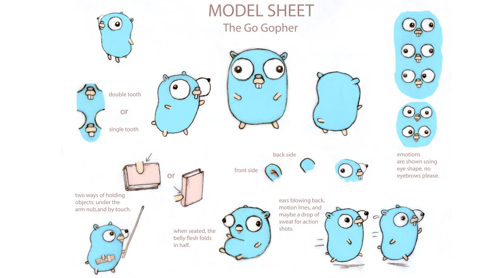
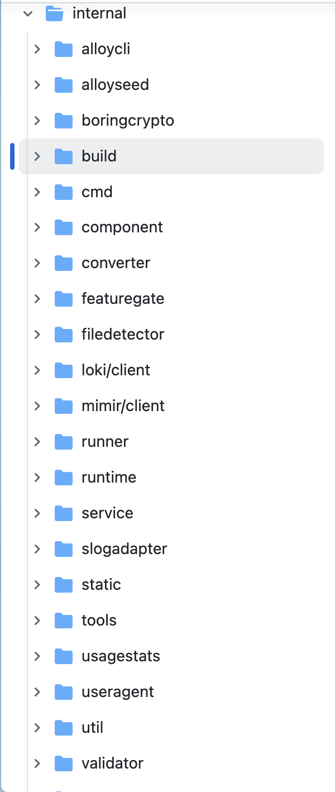

# 자기소개

안녕하세요~

클클에 7기로 들어온 장지원 입니다.

대학 수료 후 현재 취준 중에 있습니다. *어서 취직하고 싶어요🥲*

파이썬과 클라우드☁️를 사랑하지만 요즘 고랭에게 마음이 가서 이번에 알아가는 사이가 되려고 해요

저의 마음을 가져간 고퍼를 보고 가시져



약간 듀오링고 감성으로다가 정말 귀엽더라고요

## 스터디 참여 이유

내가 만든 무언가를 다른 사람들에게 소개해주고 싶어서 개발을 시작했던 것처럼,

다른 사람들이 유용하게 사용할 수 있는 오픈소스에 함께 동참하고 싶었어요.

만약 아쉽게 내 이름이 남지 못한다고 하더라도, 도구를 개발하는 그 과정 자체가 즐겁더라고요.

개발 분야에 내가 기여하고 있다는 가시적인 지표를 갖고 싶기도 해서 오픈소스 스터디에 참여하게 되었습니다.

## 오픈소스 프로젝트 후보 소개

서론을 깔고 가자면…

사실 최근에 모니터링을 공부하면서 디깅하게 됐던

Alloy에 대해 기여하고 싶었어요.

## 1. Alloy

[https://github.com/grafana/alloy](https://github.com/grafana/alloy)

Alloy는 grafana 재단에서 활발하게 운영하고 있는 opentelementry collector의 오픈소스 배포판으로, 로그, 매트릭, 트레이스, 프로파일 수집이 가능해요.

alloy를 활용해서 log, metric 수집을 한 번에 가능하도록 구성해봤는데

이전에 각각 구성하고 관리하느라 번거로웠던 것에 비해 간단하게 구성이 돼서 편리하더라고요.

하지만 깊게 이해해서 직접 단점을 찾아내고 시험해봤던 것은 아니어서 편리함을 느꼈던 만큼, 더욱 분해해서 파헤쳐보고 싶더라고요.

편리함에 정이 생기려고 하는 만큼 무작정 사용하는 것은 경계하고 싶었어요.

아 그리고 go 언어로 만들어져서

고랭 공부할 겸 해서 딱이라고 생각했습니다.

## 기여 방법

우선 Alloy 자체에 대한 분석은 당연하고, 기여 과정에 대해서도 고민해봤다.

[https://github.com/grafana/alloy/blob/main/docs/developer/contributing.md](https://github.com/grafana/alloy/blob/main/docs/developer/contributing.md)

contribution guide인데 문서에 의하면,

사소한 문제 같은 경우에는 pr로 바로 올려도 되지만

웬만하면 issues를 통해 이야기 하고 pr을 작성하는 방식을 권장한다.

```markdown
22 Should you wish to work on an issue, please claim it first by commenting on the
23 GitHub issue that you want to work on it. This is to prevent duplicated efforts
24 from contributors on the same issue.
```

직접 문제를 찾아내기 어렵다면, issues에서 `good first issue` 를 필터링해서 내가 대신 해결할 문제들을 찾는 것도 괜찮은 것 같다.

<PR 분석 과정>

1. merged 된 pr 중 conversation이 3개 이상인 pr을 위주로 분석
2. pr 작성 법 파악
3. pr에 대한 author의 코멘트를 통해 수정을 요청하거나, 주로 질문받는 부분 파악

## 스터디 계획



보시는 것처럼 내부에 폴더 및 컴포넌트가 매우 많은데요

우선 서비스 동작에 대해서 이해를 해야 각 요소들을 이해할 수 있을 것 같습니다.

그리하여

| 2주차 | 오픈소스 분석 | Alloy 동작 요소 분석 |
| --- | --- | --- |
| 3주차 | 오픈소스 분석 | 컴포넌트 분석 |
| 4주차 | 오픈소스 분석 | 컴포넌트 분석 |
| 5주차 | 오픈소스 분석 | 컴포넌트 분석 |
| 6주차 | PR 분석 |  |
| 7주차 | PR 분석 |  |

가장 보수적으로 잡았을 때, 이런 식으로 공부하려고 합니다.

PR 분석 이전에 아이디어가 생각나서 실제로 기여하면 좋겠지만,

4주 이내에 아이디어가 생각나지 않았다면

5,6 차에 pr을 분석해보려 합니다.

## 참고 자료

1. 오픈소스 기여 후기

오픈소스 관련한 많은 포스팅이 있음. pr 작성했던 후기 위주

직접 스터디도 운영 하시는 중

[[스프링 PR 기여] DefaultDataBuffer의 NativeBuffer limit 불일치 버그 고치기](https://medium.com/opensource-contributors/%EC%8A%A4%ED%94%84%EB%A7%81-pr-%EA%B8%B0%EC%97%AC-defaultdatabuffer%EC%9D%98-nativebuffer-limit-%EB%B6%88%EC%9D%BC%EC%B9%98-%EB%B2%84%EA%B7%B8-%EA%B3%A0%EC%B9%98%EA%B8%B0-fc762062fb52)

1. 오픈 소스 기여 방법

안내 자료가 좋긴한데, 생각보다 매우 방대해서 우선 몇 가지 골라 읽어야 할 것 같다.

기여 과정을 전혀 모르겠을 때 보면 좋을 듯

[Open Source Guides](https://opensource.guide/)
