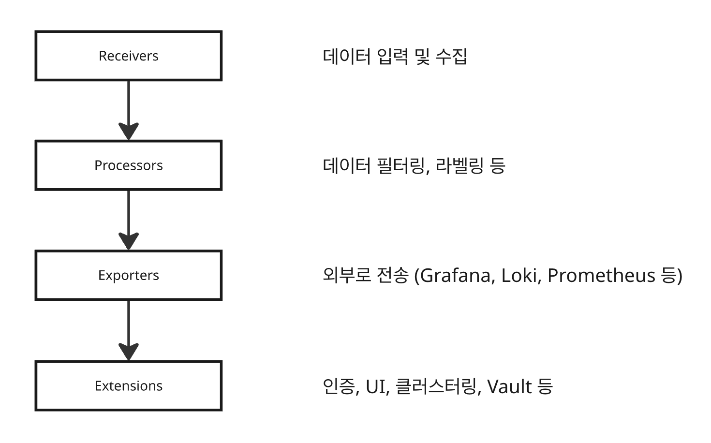

# grafana agent를 대체하게 된 Alloy

뭐가 다른걸까?

[From Agent to Alloy: Why we transitioned to the Alloy collector and why you should, too | Grafana Labs](https://grafana.com/blog/2024/04/09/grafana-agent-to-grafana-alloy-opentelemetry-collector-faq/)

## Grafana Agent?

- ELK, PLG 중에서 Grafana의 스택인 PLG의 P를 맡고 있는 Promtail이 Grafana Agent에 해당된다.
  - Promtail은 로그의 수집 역할을 지원했다
- Grafana Agent는 메트릭 수집 도구인 Prometheus의 발전에 따라 보다 더 복잡한 사용 사례에 대응하기 위해 개발되었다.
  - 하지만 에이전트가 너무 많이 생겨나서 오히려 선택이 어려운 상황이 발생
  - 여러 개의 바이너리를 관리해야 하게 됨

⇒ 그리하여 promtail, agent, operator 등을 하나로 통합하고, opentelemetry 기반으로 더 강력한 기능을 제공하는 Alloy가 등장!

Alloy로 모든 종류의 지표(로그, 메트릭 등)를 수집, 정송, 가공할 수 있다~

## opentelemetry?

- 메트릭, 로그, 트레이스, 프로파일 등 다양한 텔레메트리를 동일한 프로토콜 형식을 사용해서 전송할 수 있다.
  - telemetry : 원격으로 시스템 상태나 행동을 관찰하고 데이터를 수집하는 모든 기술을 포괄하는 개념
    - 여기에서 “대처”, “처리”의 개념이 포함되면 그게 모니터링이다~
- 수집 → 처리 → 전송 단계로 파이프라인을 구성하여 세밀한 처리 가능

| 항목 | 기존 Grafana Agent | Grafana Alloy (OTel 기반) |
| --- | --- | --- |
| **수집 대상** | 주로 메트릭 (Prometheus 포맷) | 메트릭, 로그, 트레이스, 프로파일 모두 |
| **로그/트레이스** | Promtail, Tempo 등 별도 에이전트 필요 | 한 바이너리로 모두 처리 가능 |
| **구성 방식** | 비교적 정적인 구성 (Prometheus-style 설정) | 유연한 파이프라인 구성 (OTel 스타일) |
| **표준 호환성** | Prometheus 중심 | OTLP 100% 호환 (벤더 중립적) |
| **에코시스템 통합** | Grafana 중심 | 다양한 백엔드 연동(Grafana, Datadog, New Relic 등) |
| **운영 복잡도** | 환경별 별도 바이너리 필요 (Agent, Operator, Promtail 등) | Alloy 하나로 통합 운영 가능 |

- Alloy는 github, s3, http등 원격지에서 직접 데이터를 불러올 수 있음
  - s3에 업뎃된 파일을 alloy가 주기적으로 가져오는 활동이 가능
- 자체 Debugging UI를 통해 현재 구성 상태, 수집 흐름, 에러 등을 시각적으로 확인할 수 있음 (`localhost:12345` )

## 구조



### 1. 데이터 수신

- `scraper` / `exporter` / `receiver`

### 2. 데이터 전처리

- `relabel` / `converter` / `filter`

### 3. 외부 전송

`remote_write` / `write`

### 4. 부가 기능

`discovery`, `logging`, `processor` 등

### 5. 실행 환경(전체를 감싸는)

- 모듈들을 초기화하고 실행함
- 데이터 프름을 조정
- 구성 파일을 기반으로 전체 파이프라인을 스케줄링 및 관리
- 모듈들은 이 실행 환경(runtime) 위에서 동작하게 됨
- Alloy Runtime
  - 원래는 함께 동작하지 않던 OTL과 prometheus를 Alloy Syntax로 묶어 컴포넌트로 만들어서 함께 동작하도록 함

## 구성 파일

- alloy는 `.alloy` 를 config 파일의 확장자로 사용함
- 구성 파일 경로
  - Linux: `/etc/alloy/config.alloy`
  - macOS: `$(brew --prefix)/etc/alloy/config.alloy`
  - Windows: `%ProgramFiles%\GrafanaLabs\Alloy\config.alloy`
- 예시

```yaml
discovery.kubernetes "services" {
  role = "service"

  namespaces {
    own_namespace = false
    names = ["default"]
  }

  selectors {
    role  = "service"
    label = "environment in (production)"
  }
}

prometheus.scrape "services" {
  targets = discovery.kubernetes.services.targets
  forward_to = [prometheus.relabel.k8s_services.receiver]
}

prometheus.relabel "k8s_services" {
  forward_to = [prometheus.remote_write.default.receiver]

  rule {
    source_labels = ["job"]
    target_label  = "job"
    replacement   = "k8s_service"
    action        = "replace"
  }

  rule {
    source_labels = ["namespace"]
    target_label  = "ns"
    action        = "replace"
  }

  rule {
    target_label  = "environment"
    replacement   = "unknown"
    action        = "replace"
  }
}

prometheus.remote_write "default" {
  endpoint {
    url = "http://localhost:9009/api/prom/push"
  }
}

```

## 모듈

- 현재 alloy는 다양한 모듈을 지원하고 있다.

[Components |  Grafana Alloy documentation](https://grafana.com/docs/alloy/latest/reference/components/)

- 데이터 베이스의 상태 또한 추적 가능하다.

## 다음 주차 할 일

1. `good first issue` 태그 pr 확인 및 분석
2. `to-do` 태그 확인 및 분석
