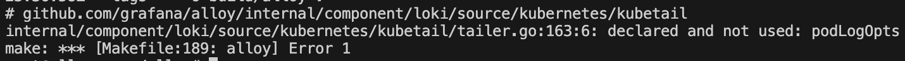

# 저번 주차 과제

1. 빌드 중 디스크 부족 해결 방안 생각 → 클라우드 or 집에 있는 홈서버
2. 수정사항 테스트

## 디스크 부족 문제

로컬 자원이 부족하다면 클라우드!(지갑이 부족해질 뿐)

그리하여 vCPU 2EA, 메모리 8GB, 스토리지 10GB의 우분투 서버를 생성

근데 이것도 부팅할 때는 부족해서 한 번 더 스펙 업 해서 진행(16 메모리, 스토리지 20)

그 후 빌드 시도!



함수를 선언해두고 쓰지 않으면 해당 오픈소스는 오류를 반환한다.

이와 관련된 오류들을 해결하고 다시 빌드

```bash
root@alloysvr:~/alloy# make alloy
GOEXPERIMENT= GOOS=linux GOARCH=amd64 GOARM= CGO_ENABLED=1 go build  -ldflags "-X github.com/grafana/alloy/internal/build.Branch=main -X github.com/grafana/alloy/internal/build.Version=v1.10.0-devel+dirty -X github.com/grafana/alloy/syntax/stdlib.Version=v1.10.0-devel+dirty -X github.com/grafana/alloy/internal/build.Revision=0c7c5387b -X github.com/grafana/alloy/internal/build.BuildUser=root@alloysvr -X github.com/grafana/alloy/internal/build.BuildDate=2025-06-14T02:27:12Z" -tags "" -o build/alloy .
```

빌드를 하는데 이제는 오류도 뜨지 않고 여기서 1분 뒤에 멈춰버린다..

메모리, 스토리지는 모두 충분한 것을 확인하였다.

이 부분을 계속 트러블슈팅 해야 할 것 같다.
