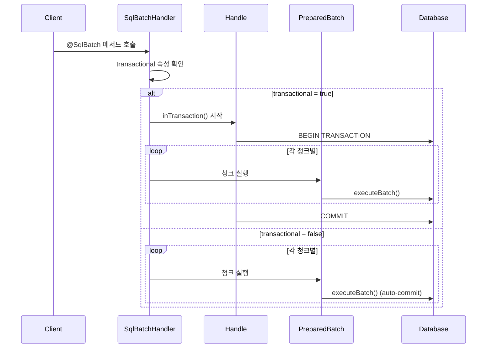

# week4

### @SqlBatch 어노테이션 기본 구조

```java
@SqlBatch("INSERT INTO user (id, name) VALUES (:id, :name)")
@BatchChunkSize(1000)  // 청크 크기 지정
int[] insertUsers(@BindBean Collection<User> users);
```

### 핵심 특징

- **선언적 배치 처리**: 어노테이션만으로 배치 기능 구현
- **자동 청킹 지원**: `@BatchChunkSize`로 청크 크기 설정 가능
- **트랜잭션 제어**: `transactional` 속성으로 트랜잭션 동작 제어
- **타입 안전성**: 컴파일 타임에 타입 체크

---

## 트랜잭션 처리 메커니즘 분석

### 1. 기본 트랜잭션 동작

### @SqlBatch의 transactional 속성

```java
public @interface SqlBatch {
    String value() default "";
    boolean transactional() default true;  // 기본값: true
}
```

### SqlBatchHandler에서의 트랜잭션 처리

```java
// SqlBatchHandler.invoke() 메서드 핵심 부분
if (sqlBatch.transactional()) {
    return handle.inTransaction(c -> batchIntermediate.apply(preparedBatchSupplier.get()));
} else {
    return batchIntermediate.apply(preparedBatchSupplier.get());
}
```

### 2. 트랜잭션 시나리오별 동작

### 시나리오 1: `transactional = true` (기본값)

```java
@SqlBatch(value = "INSERT INTO user VALUES (:id, :name)", transactional = true)
@BatchChunkSize(1000)
int[] insertUsers(@BindBean Collection<User> users);
```

**동작 방식:**

- 전체 배치가 **하나의 트랜잭션**으로 처리
- 청킹이 있어도 **모든 청크가 같은 트랜잭션** 내에서 실행
- 중간에 실패 시 **전체 롤백**
- `handle.inTransaction()` 내에서 모든 청크 실행

### 시나리오 2: `transactional = false`

```java
@SqlBatch(value = "INSERT INTO user VALUES (:id, :name)", transactional = false)
@BatchChunkSize(1000)
int[] insertUsers(@BindBean Collection<User> users);
```

**동작 방식:**

- 각 청크가 **별도의 트랜잭션**으로 처리 (또는 auto-commit)
- 중간 실패 시 **성공한 청크는 커밋 유지**
- 실패한 청크부터 처리 중단

### 3. 실제 트랜잭션 흐름



---

## 청킹(Chunking) 구현 방식

### 1. @BatchChunkSize 어노테이션 구조

```java
@Retention(RetentionPolicy.RUNTIME)
@Target({ElementType.METHOD, ElementType.PARAMETER, ElementType.TYPE})
public @interface BatchChunkSize {
    int value() default -1;  // 청크 크기
}
```

### 2. 청킹 사용 패턴

### 정적 청크 크기 (메서드 레벨)

```java
@SqlBatch("INSERT INTO user VALUES (:id, :name)")
@BatchChunkSize(1000)  // 항상 1000개씩 처리
int[] insertUsers(@BindBean Collection<User> users);
```

### 동적 청크 크기 (파라미터 레벨)

```java
@SqlBatch("INSERT INTO user VALUES (:id, :name)")
int[] insertUsers(@BatchChunkSize int chunkSize, @BindBean Collection<User> users);
```

### 타입 레벨 기본값

```java
@BatchChunkSize(500)  // 클래스 전체 기본값
public interface UserDao {
    @SqlBatch("INSERT INTO user VALUES (:id, :name)")
    int[] insertUsers(@BindBean Collection<User> users);  // 500 사용

    @SqlBatch("INSERT INTO user VALUES (:id, :name)")
    @BatchChunkSize(1000)  // 메서드 레벨이 우선
    int[] bulkInsertUsers(@BindBean Collection<User> users);  // 1000 사용
}
```

### 3. SqlBatchHandler의 청킹 처리 로직

### ChunkSizeFunction 인터페이스

```java
private interface ChunkSizeFunction {
    int call(Object[] args);
}

private static class ConstantChunkSizeFunction implements ChunkSizeFunction {
    private final int chunkSize;

    ConstantChunkSizeFunction(int chunkSize) {
        this.chunkSize = chunkSize;
    }

    @Override
    public int call(Object[] args) {
        return chunkSize;
    }
}
```

### 실제 청킹 실행 로직 (의사 코드)

```java
// SqlBatchHandler.invoke() 메서드 내부
Function<PreparedBatch, ?> batchIntermediate = batch -> {
    int chunkSize = chunkSizeFunction.call(args);  // 청크 크기 결정

    if (chunkSize > 0) {
        // 청킹 처리
        return executeInChunks(batch, chunkSize);
    } else {
        // 전체 한 번에 처리
        return batch.execute();
    }
};

private Object executeInChunks(PreparedBatch batch, int chunkSize) {
    List<Integer> allResults = new ArrayList<>();
    int processedCount = 0;
    int totalCount = batch.size();

    while (processedCount < totalCount) {
        int currentChunkSize = Math.min(chunkSize, totalCount - processedCount);

        // 현재 청크만큼 PreparedBatch에서 실행
        int[] chunkResults = executeChunk(batch, processedCount, currentChunkSize);

        // 결과 병합
        for (int result : chunkResults) {
            allResults.add(result);
        }

        processedCount += currentChunkSize;
    }

    return allResults.stream().mapToInt(Integer::intValue).toArray();
}

```

---

## SqlBatchHandler 상세 분석

### 1. 핵심 메서드 구조

```java
public class SqlBatchHandler extends CustomizingStatementHandler {

    @Override
    public Object invoke(HandleSupplier handleSupplier, Object target, Object... args) {
        final Handle handle = handleSupplier.getHandle();
        final SqlBatch sqlBatch = method.getAnnotation(SqlBatch.class);

        // 1. 청크 크기 결정
        final ChunkSizeFunction chunkSizeFunction = determineChunkSize();

        // 2. PreparedBatch 생성 및 바인딩
        final Supplier<PreparedBatch> preparedBatchSupplier = () -> {
            PreparedBatch batch = handle.prepareBatch(locateAndRenderSql());
            bindArguments(batch, args);  // 모든 argument를 배치에 바인딩
            return batch;
        };

        // 3. 배치 실행 로직 (청킹 포함)
        Function<PreparedBatch, ?> batchIntermediate = createBatchExecutor(chunkSizeFunction);

        // 4. 트랜잭션 적용 여부 결정
        if (sqlBatch.transactional()) {
            return handle.inTransaction(c -> batchIntermediate.apply(preparedBatchSupplier.get()));
        } else {
            return batchIntermediate.apply(preparedBatchSupplier.get());
        }
    }
}
```

### 2. 바인딩 처리 방식

### Iterable 파라미터 처리

```java
// SqlBatchHandler에서 Iterable 파라미터를 찾아서 각 요소를 배치에 바인딩
private void bindArguments(PreparedBatch batch, Object[] args) {
    // Iterable arguments 찾기 (Collection, List, Iterator 등)
    List<Iterator<?>> iterableArgs = findIterableArguments(args);

    // 가장 짧은 Iterable 길이로 맞춤 (zip 동작)
    while (hasNextInAll(iterableArgs)) {
        // 각 바인딩을 PreparedBatch에 추가
        for (int i = 0; i < iterableArgs.size(); i++) {
            Object value = iterableArgs.get(i).next();
            batch.bind(parameterNames.get(i), value);
        }
        batch.add();  // 현재 바인딩을 배치에 추가
    }
}
```

### 3. 결과 타입 처리

```java
// 반환 타입에 따른 결과 변환
private Object convertResults(int[] batchResults, Class<?> returnType) {
    if (returnType == Void.TYPE) {
        return null;
    } else if (returnType == int[].class) {
        return batchResults;
    } else if (returnType == boolean[].class) {
        return Arrays.stream(batchResults)
                    .mapToObj(count -> count > 0)
                    .toArray(Boolean[]::new);
    }
    throw new IllegalArgumentException("Unsupported return type: " + returnType);
}
```

---

## 실제 구현 사례

### 1. 트랜잭션 동작 검증 코드

```java
// 테스트 케이스: transactional = true
@Test
public void testTransactionalBatchRollback() {
    @SqlBatch(value = "INSERT INTO user VALUES (:id, :name)", transactional = true)
    @BatchChunkSize(2)
    interface TestDao {
        int[] insertUsers(@BindBean Collection<User> users);
    }

    TestDao dao = handle.attach(TestDao.class);

    List<User> users = Arrays.asList(
        new User(1, "Alice"),
        new User(2, "Bob"),
        new User(1, "Charlie")  // PK 충돌로 실패
    );

    assertThatThrownBy(() -> dao.insertUsers(users))
        .isInstanceOf(RuntimeException.class);

    // 전체 롤백 확인
    int count = handle.createQuery("SELECT COUNT(*) FROM user")
                     .mapTo(Integer.class).one();
    assertThat(count).isEqualTo(0);  // 모두 롤백됨
}

// 테스트 케이스: transactional = false
@Test
public void testNonTransactionalBatchPartialSuccess() {
    @SqlBatch(value = "INSERT INTO user VALUES (:id, :name)", transactional = false)
    @BatchChunkSize(2)
    interface TestDao {
        int[] insertUsers(@BindBean Collection<User> users);
    }

    TestDao dao = handle.attach(TestDao.class);

    List<User> users = Arrays.asList(
        new User(1, "Alice"),
        new User(2, "Bob"),     // 첫 번째 청크: 성공
        new User(1, "Charlie"), // 두 번째 청크: 실패 (PK 충돌)
        new User(3, "David")
    );

    assertThatThrownBy(() -> dao.insertUsers(users))
        .isInstanceOf(RuntimeException.class);

    // 부분 성공 확인
    int count = handle.createQuery("SELECT COUNT(*) FROM user")
                     .mapTo(Integer.class).one();
    assertThat(count).isEqualTo(2);  // 첫 번째 청크는 커밋됨
}

```

### 2. 청킹 동작 확인

```java
@Test
public void testChunkingBehavior() {
    @SqlBatch("INSERT INTO user VALUES (:id, :name)")
    @BatchChunkSize(3)
    interface UserDao {
        int[] insertUsers(@BindBean Collection<User> users);
    }

    UserDao dao = handle.attach(UserDao.class);

    // 7개 데이터 = 3개 + 3개 + 1개 청크로 처리
    List<User> users = IntStream.range(1, 8)
        .mapToObj(i -> new User(i, "User" + i))
        .collect(Collectors.toList());

    int[] results = dao.insertUsers(users);

    assertThat(results).hasSize(7);
    assertThat(results).allMatch(count -> count == 1);

    // 실제로 3번의 executeBatch() 호출이 있었는지 확인
    // (로깅이나 모킹을 통해 검증 가능)
}

```

---

## 이슈 #2749 해결을 위한 인사이트

### 1. SqlBatchHandler에서 배울 점

### 트랜잭션 처리 패턴

```java
// SqlBatchHandler의 트랜잭션 처리 방식을 PreparedBatch에 적용
public class PreparedBatch {
    private boolean transactional = true;  // 기본값

    public PreparedBatch setTransactional(boolean transactional) {
        this.transactional = transactional;
        return this;
    }

    public int[] execute() {
        if (transactional && batchChunkSize > 1) {
            return getHandle().inTransaction(h -> executeWithChunking());
        } else {
            return executeWithChunking();
        }
    }
}

```

### 청킹 로직 적용

```java
private int[] executeWithChunking() {
    if (batchChunkSize <= 1 || bindings.size() <= batchChunkSize) {
        // 청킹 불필요
        return executeAllAtOnce();
    }

    // 청킹 실행
    List<Integer> allResults = new ArrayList<>();
    int totalBindings = bindings.size();

    for (int start = 0; start < totalBindings; start += batchChunkSize) {
        int end = Math.min(start + batchChunkSize, totalBindings);
        int[] chunkResults = executeChunk(start, end);

        for (int result : chunkResults) {
            allResults.add(result);
        }
    }

    return allResults.stream().mapToInt(Integer::intValue).toArray();
}

```

### 2. 구현 시 고려사항

### API 설계

- **메서드 체이닝**: `setBatchChunkSize()` 반환 타입을 `PreparedBatch`로
- **기본값**: 청크 크기 기본값을 적절히 설정 (무제한 = Integer.MAX_VALUE)
- **검증**: 청크 크기 검증 (양수만 허용)

### 성능 최적화

- **ArgumentBinder 재사용**: 청크 간 바인더 객체 재사용
- **메모리 효율성**: 결과 배열을 효율적으로 병합
- **PreparedStatement 관리**: 청크 실행 간 statement 재사용

### 오류 처리

- **중간 실패 처리**: 청크 실행 중 실패 시 적절한 예외 처리
- **리소스 정리**: 실패 시에도 리소스 정리 보장
- **에러 메시지**: 어떤 청크에서 실패했는지 명확한 정보 제공

### 3. 테스트 전략

```java
// 필수 테스트 케이스들
@Test void testBasicChunking() { /* 기본 청킹 동작 */ }
@Test void testChunkSizeValidation() { /* 청크 크기 검증 */ }
@Test void testTransactionalChunking() { /* 트랜잭션과 청킹 조합 */ }
@Test void testChunkFailureHandling() { /* 청크 실패 처리 */ }
@Test void testBackwardCompatibility() { /* 기존 API 호환성 */ }
@Test void testPerformanceComparison() { /* 성능 비교 */ }

```

---

## 결론

### 주요 발견사항

1. **SQL Object의 강점**
    - `@BatchChunkSize`와 `transactional` 속성으로 완성도 높은 배치 처리
    - 선언적 방식으로 복잡한 로직을 숨김
    - 트랜잭션과 청킹이 깔끔하게 통합됨
2. **PreparedBatch의 한계**
    - 청킹 기능 부재로 대용량 배치 처리 시 불편
    - 수동 트랜잭션 관리 필요
    - 보일러플레이트 코드 증가
3. **구현 방향성**
    - SqlBatchHandler의 청킹 로직을 PreparedBatch에 적용
    - 트랜잭션 제어 옵션 추가 고려
    - 기존 API 호환성 유지하며 기능 확장

### 다음 단계

1. **프로토타입 구현**: 기본 청킹 기능 구현
2. **성능 검증**: 기존 방식 대비 성능 영향 측정
3. **통합 테스트**: SQL Object와 동일한 동작 보장
4. **문서화**: 사용법 및 주의사항 정리

---

*이 분석을 바탕으로 PreparedBatch에 청킹 기능을 효과적으로 구현할 수 있을 것입니다.*