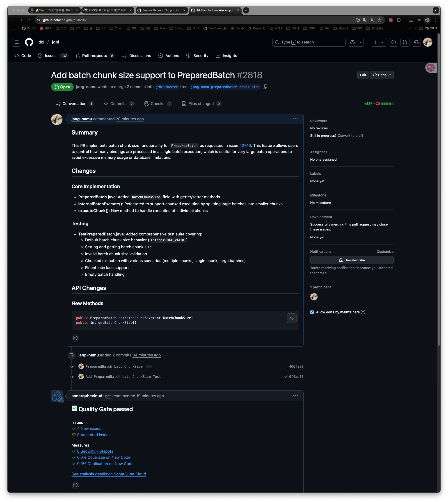
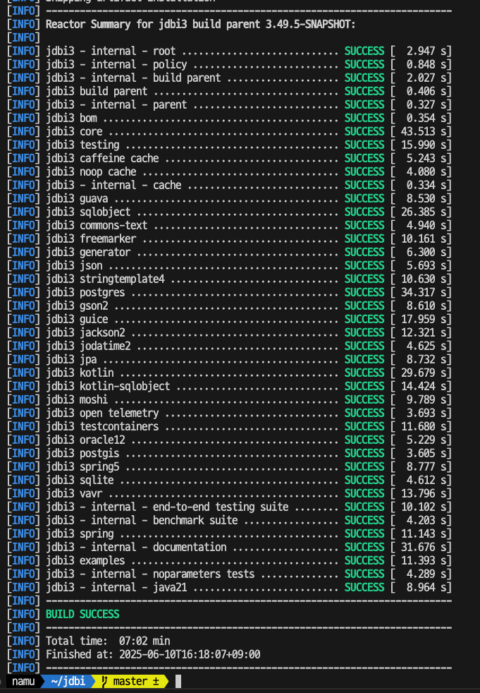
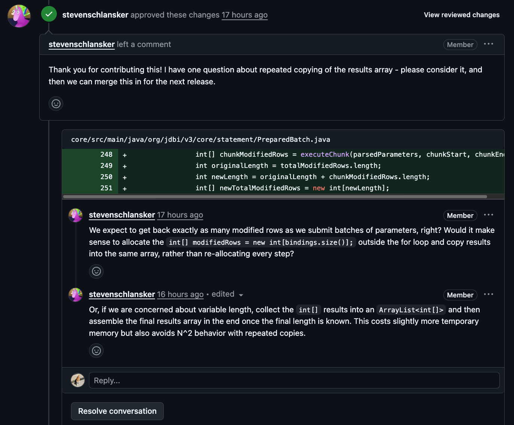

# week5-6 PR작성

- 타임라인
    1. **2주차**: JDBI 아키텍처 및 핵심 모듈 분석
        - 핵심 클래스 구조 파악
        - SQL Object 인터페이스와 Fluent API 이해하기
        - 관련 테스트 코드 분석 및 실행
        - 간단한 예제 구현해보기
    2. **3주차**: BatchChunkSize 기능 및 PreparedBatch 심층 분석
        - `@BatchChunkSize` 애노테이션 코드 분석
        - PreparedBatch 클래스 세부 구현 파악
        - 관련 테스트 케이스 분석 및 실행
        - 현재 구현의 한계점 정리하기
    3. **4주차**: 이슈 해결을 위한 설계 및 구현 계획
        - 코드 수정 상세 계획 수립
        - 관련 인터페이스 및 클래스 검토
        - 구현에 필요한 변경사항 리스트 작성
        - 초기 테스트 케이스 설계하기
    4. **5주차**: 코드 구현 및 테스트
        - PreparedBatch에 청크 크기 지원 기능 구현
        - 단위 테스트 작성 및 실행
        - 기존 테스트와의 호환성 확인
        - 기능 테스트를 위한 예제 애플리케이션 구현

빌드 시도

```bash
make install
```

Makefile 빌드 실패 

```bash
[INFO] 
[INFO] --- inline:1.5.0:inline (default) @ jdbi3-core ---
[INFO] Inlined dependencies
[INFO] ====================
[INFO]     org.antlr:antlr4-runtime:jar:4.13.2 (compile)
[INFO] 
[INFO] 
[INFO] Transitive dependencies
[INFO] =======================
[INFO] 
[INFO] Replacing original artifact with inlined artifact.
[INFO] 
[INFO] --- jacoco:0.8.13:prepare-agent-integration (basepom.default-it) @ jdbi3-core ---
[INFO] basepom.coverage.it-args set to -javaagent:/Users/namu/.m2/repository/org/jacoco/org.jacoco.agent/0.8.13/org.jacoco.agent-0.8.13-runtime.jar=destfile=/Users/namu/jdbi/core/target/jacoco-it.exec
[INFO] 
[INFO] --- invoker:3.9.0:install (basepom.invoker-integration-testing.default) @ jdbi3-core ---
[INFO] Skipping artifact installation per configuration.
[INFO] 
[INFO] --- invoker:3.9.0:integration-test (basepom.invoker-integration-testing.default) @ jdbi3-core ---
[INFO] Skipping invocation per configuration. If this is incorrect, ensure the skipInvocation parameter is not set to true.
[INFO] 
[INFO] --- invoker:3.9.0:verify (basepom.invoker-integration-testing.default) @ jdbi3-core ---
[INFO] Skipping invocation per configuration. If this is incorrect, ensure the skipInvocation parameter is not set to true.
[INFO] 
[INFO] --- property-helper:4.1.0:get (japicmp) @ jdbi3-core ---
[INFO] 
[INFO] --- japicmp:0.23.1:cmp (default) @ jdbi3-core ---
[INFO] ------------------------------------------------------------------------
[INFO] Reactor Summary for jdbi3 build parent 3.49.5-SNAPSHOT:
[INFO] 
[INFO] jdbi3 - internal - root ............................ SUCCESS [  2.749 s]
[INFO] jdbi3 - internal - policy .......................... SUCCESS [  0.808 s]
[INFO] jdbi3 - internal - build parent .................... SUCCESS [  1.925 s]
[INFO] jdbi3 build parent ................................. SUCCESS [  0.344 s]
[INFO] jdbi3 - internal - parent .......................... SUCCESS [  0.278 s]
[INFO] jdbi3 bom .......................................... SUCCESS [  0.353 s]
[INFO] jdbi3 core ......................................... FAILURE [ 21.581 s]
[INFO] jdbi3 testing ...................................... SKIPPED
[INFO] jdbi3 caffeine cache ............................... SKIPPED
[INFO] jdbi3 noop cache ................................... SKIPPED
[INFO] jdbi3 - internal - cache ........................... SKIPPED
[INFO] jdbi3 guava ........................................ SKIPPED
[INFO] jdbi3 sqlobject .................................... SKIPPED
[INFO] jdbi3 commons-text ................................. SKIPPED
[INFO] jdbi3 freemarker ................................... SKIPPED
[INFO] jdbi3 generator .................................... SKIPPED
[INFO] jdbi3 json ......................................... SKIPPED
[INFO] jdbi3 stringtemplate4 .............................. SKIPPED
[INFO] jdbi3 postgres ..................................... SKIPPED
[INFO] jdbi3 gson2 ........................................ SKIPPED
[INFO] jdbi3 guice ........................................ SKIPPED
[INFO] jdbi3 jackson2 ..................................... SKIPPED
[INFO] jdbi3 jodatime2 .................................... SKIPPED
[INFO] jdbi3 jpa .......................................... SKIPPED
[INFO] jdbi3 kotlin ....................................... SKIPPED
[INFO] jdbi3 kotlin-sqlobject ............................. SKIPPED
[INFO] jdbi3 moshi ........................................ SKIPPED
[INFO] jdbi3 open telemetry ............................... SKIPPED
[INFO] jdbi3 testcontainers ............................... SKIPPED
[INFO] jdbi3 oracle12 ..................................... SKIPPED
[INFO] jdbi3 postgis ...................................... SKIPPED
[INFO] jdbi3 spring5 ...................................... SKIPPED
[INFO] jdbi3 sqlite ....................................... SKIPPED
[INFO] jdbi3 vavr ......................................... SKIPPED
[INFO] jdbi3 - internal - end-to-end testing suite ........ SKIPPED
[INFO] jdbi3 - internal - benchmark suite ................. SKIPPED
[INFO] jdbi3 spring ....................................... SKIPPED
[INFO] jdbi3 - internal - documentation ................... SKIPPED
[INFO] jdbi3 examples ..................................... SKIPPED
[INFO] jdbi3 - internal - noparameters tests .............. SKIPPED
[INFO] jdbi3 - internal - java21 .......................... SKIPPED
[INFO] ------------------------------------------------------------------------
[INFO] BUILD FAILURE
[INFO] ------------------------------------------------------------------------
[INFO] Total time:  28.435 s
[INFO] Finished at: 2025-06-09T18:23:35+09:00
[INFO] ------------------------------------------------------------------------
[ERROR] Failed to execute goal com.github.siom79.japicmp:japicmp-maven-plugin:0.23.1:cmp (default) on project jdbi3-core: Execution default of goal com.github.siom79.japicmp:japicmp-maven-plugin:0.23.1:cmp failed: version can neither be null, empty nor blank -> [Help 1]
[ERROR] 
[ERROR] To see the full stack trace of the errors, re-run Maven with the -e switch.
[ERROR] Re-run Maven using the -X switch to enable full debug logging.
[ERROR] 
[ERROR] For more information about the errors and possible solutions, please read the following articles:
[ERROR] [Help 1] http://cwiki.apache.org/confluence/display/MAVEN/PluginExecutionException
[ERROR] 
[ERROR] After correcting the problems, you can resume the build with the command
[ERROR]   mvn <args> -rf :jdbi3-core
```

Makefile 수정

```bash
export MAVEN_OPTS
export MAVEN_ARGS

#From

install::
	${MAVEN} clean install
	
#To
	
install:: MAVEN_ARGS += -Djapicmp.skip=true
install::
	${MAVEN} clean install
```

japicmp 스킵하고 빌드하도록 설정 (Makefile에 Maven 인자 추가)

- japicmp는 API 호환성 검사도구 (jdbi3 - internal - build parent에서 상속받아 포함됨)

---

## 이슈 개요

- **제목**: Feature Request: Support batch chunk size directly in PreparedBatch implementation
- **작성자**: alkamo
- **작성일**: 2025년 1월 24일
- **라벨**: feature, good-first-issue
- **상태**: Open

## 이슈 내용 분석

### 요청 기능

이 이슈는 JDBI 라이브러리의 `PreparedBatch` 클래스에 배치 청크 크기(batch chunk size)를 직접 설정할 수 있는 기능을 추가해달라는 요청입니다. 현재 SQL Object 인터페이스에서는 `@BatchChunkSize` 어노테이션을 통해 한 번에 처리할 행 수를 설정할 수 있지만, `PreparedBatch`를 직접 사용할 때는 이러한 기능이 없습니다.

### 현재 상황

현재 `PreparedBatch`를 사용할 때 많은 수의 데이터를 처리하려면 수동으로 청크 처리를 구현해야 합니다. 이슈 작성자가 제시한 예시 코드는 다음과 같습니다:

```java
int counter = 0;
try(PreparedBatch insertQuery = getHandle().prepareBatch("insert :value into some_table")
{
   for (Integer values : valueList)
   {
      insertQuery.bind("value", value).add();
      counter++;
      if (counter >= 10000)
      {
         insertQuery.execute();
         counter = 0;
      }
   }
   if (counter > 0)
   {
      insertQuery.execute();
  }
}
```

이 코드는 10,000개의 항목마다 배치를 실행하는 로직을 수동으로 구현한 것입니다. 이는 반복적인 보일러플레이트 코드를 작성해야 하는 불편함이 있습니다.

### 제안된 해결책

이슈 작성자는 `PreparedBatch` 클래스에 `setBatchChunkSize` 메서드를 추가하여 다음과 같이 간결하게 코드를 작성할 수 있게 하자고 제안합니다:

```java
try(PreparedBatch insertQuery = getHandle().prepareBatch("insert :value into some_table")
{
   insertQuery.setBatchChunkSize(10000);
   values.forEach(value -> insertQuery.bind("value", value).add());
   insertQuery.execute();
}
```

이 방식을 사용하면 사용자가 원하는 수의 바인딩 파라미터 세트를 입력할 수 있고, `execute`가 호출될 때 설정된 청크 크기에 따라 여러 번의 배치 실행이 이루어집니다.

### 기존 코드 분석

org.jdbi.v3.sqlobject.statement.internal.SqlBatchHandler 클래스

이 클래스는 SQL Object 인터페이스에서 @SqlBatch 어노테이션이 붙은 메서드를 처리하는 핸들러입니다. 이 클래스에서 BatchChunkSize 어노테이션을 처리하는 방법을 볼 수 있습니다.

```java
    private SqlBatchHandler.ChunkSizeFunction determineBatchChunkSize(Class<?> sqlObjectType, Method method) {
        // this next big if chain determines the batch chunk size. It looks from most specific
        // scope to least, that is: as an argument, then on the method, then on the class,
        // then default to Integer.MAX_VALUE

        int batchChunkSizeParameterIndex = indexOfBatchChunkSizeParameter(method);
        if (batchChunkSizeParameterIndex >= 0) {
            return new ParamBasedChunkSizeFunction(batchChunkSizeParameterIndex);
        } else if (method.isAnnotationPresent(BatchChunkSize.class)) {
            final int size = method.getAnnotation(BatchChunkSize.class).value();
            if (size <= 0) {
                throw new IllegalArgumentException("Batch chunk size must be >= 0");
            }
            return new ConstantChunkSizeFunction(size);
        } else if (sqlObjectType.isAnnotationPresent(BatchChunkSize.class)) {
            final int size = sqlObjectType.getAnnotation(BatchChunkSize.class).value();
            return new ConstantChunkSizeFunction(size);
        } else {
            return new ConstantChunkSizeFunction(Integer.MAX_VALUE);
        }
    }
```

특히, `determineBatchChunkSize` 메서드에서 배치 청크 크기를 결정하는 로직을 볼 수 있습니다. 이 메서드는 다음과 같은 순서로 배치 청크 크기를 결정합니다:

1. 메서드 매개변수에 @BatchChunkSize 어노테이션이 있는 경우, 해당 매개변수의 값을 사용합니다.
2. 메서드에 @BatchChunkSize 어노테이션이 있는 경우, 해당 어노테이션의 값을 사용합니다.
3. 클래스에 @BatchChunkSize 어노테이션이 있는 경우, 해당 어노테이션의 값을 사용합니다.
4. 위의 모든 경우가 아니면, Integer.MAX_VALUE를 사용합니다.

이제 이슈에서 요청한 기능을 이해할 수 있습니다. 현재 PreparedBatch 클래스에는 배치 청크 크기를 직접 설정할 수 있는 방법이 없습니다. 이슈에서는 PreparedBatch 클래스에 setBatchChunkSize 메서드를 추가하여 배치 청크 크기를 직접 설정할 수 있도록 하는 기능을 요청하고 있습니다.

이제 이슈에서 제안한 구현 방법을 살펴보겠습니다. 이슈에서는 다음과 같은 코드를 제안하고 있습니다:

```java
try(PreparedBatch insertQuery = getHandle().prepareBatch("insert :value into some_table")
{
   insertQuery.setBatchChunkSize(10000);
   values.forEach(value -> insertQuery.bind("value", value).add());
   insertQuery.execute();
}
```

이 코드에서는 PreparedBatch 객체에 setBatchChunkSize 메서드를 호출하여 배치 청크 크기를 설정하고, 그 후에 모든 값을 바인딩한 다음 execute 메서드를 호출합니다. 이렇게 하면 execute 메서드 내부에서 설정된 청크 크기에 따라 여러 번의 배치 실행이 이루어질 것입니다.

현재 PreparedBatch 클래스의 execute 메서드는 모든 바인딩을 한 번에 실행합니다. 이슈에서 요청하는 기능을 구현하려면, PreparedBatch 클래스에 배치 청크 크기를 설정할 수 있는 메서드를 추가하고, execute 메서드를 수정하여 설정된 청크 크기에 따라 여러 번의 배치 실행을 수행하도록 해야 합니다.

## 기술적 분석

### 현재 구현

- `PreparedBatch` 클래스는 현재 모든 바인딩을 한 번에 실행합니다.
- SQL Object 인터페이스에서는 `@BatchChunkSize` 어노테이션을 통해 배치 청크 크기를 설정할 수 있습니다.
- `SqlBatchHandler` 클래스에서 `@BatchChunkSize` 어노테이션을 처리하는 로직이 구현되어 있습니다.

### 구현 방향

1. `PreparedBatch` 클래스에 `setBatchChunkSize` 메서드 추가
2. `execute` 메서드 수정하여 설정된 청크 크기에 따라 여러 번의 배치 실행을 수행하도록 변경
3. 기본 청크 크기는 무제한(Integer.MAX_VALUE)으로 설정하여 기존 동작과 호환성 유지

### 이점

- 코드 간결화: 반복적인 보일러플레이트 코드 제거
- 일관성: SQL Object 인터페이스와 직접 `PreparedBatch` 사용 시 동일한 기능 제공
- 성능 최적화: 대량의 데이터 처리 시 메모리 사용량 및 데이터베이스 부하 관리 용이

## 수정해야 할 파일

`core/src/main/java/org/jdbi/v3/core/statement/PreparedBatch.java`

## 수정 내용

```java
// PreparedBatch.java에 다음 필드 추가
private int batchChunkSize = Integer.MAX_VALUE; // 기본값은 제한 없음

// 배치 청크 크기를 설정하는 메서드 추가
/**
 * Sets the batch chunk size - the maximum number of bindings to include in a single batch execution.
 * When the number of bindings exceeds this size, multiple batch executions will be performed.
 * <p>
 * This is useful for very large batch operations to avoid excessive memory usage or database limitations.
 *
 * @param batchChunkSize the maximum number of bindings to include in a single batch execution
 * @return this
 * @throws IllegalArgumentException if batchChunkSize is less than or equal to zero
 */
public PreparedBatch setBatchChunkSize(int batchChunkSize) {
    if (batchChunkSize <= 0) {
        throw new IllegalArgumentException("Batch chunk size must be greater than zero");
    }
    this.batchChunkSize = batchChunkSize;
    return this;
}

// 현재 배치 청크 크기를 반환하는 메서드 추가
/**
 * Gets the current batch chunk size.
 *
 * @return the current batch chunk size
 */
public int getBatchChunkSize() {
    return batchChunkSize;
}

// internalBatchExecute 메서드 수정
private ExecutedBatch internalBatchExecute() {
    if (!getBinding().isEmpty()) {
        add();
    }

    beforeTemplating();

    final StatementContext ctx = getContext();

    ParsedSql parsedSql = parseSql();
    String sql = parsedSql.getSql();
    ParsedParameters parsedParameters = parsedSql.getParameters();

    try {
        try {
            stmt = createStatement(sql);

            getContext().addCleanable(() -> cleanupStatement(stmt));
            getConfig(SqlStatements.class).customize(stmt);
        } catch (SQLException e) {
            throw new UnableToCreateStatementException(e, ctx);
        }

        if (bindings.isEmpty()) {
            return new ExecutedBatch(stmt, new int[0]);
        }

        beforeBinding();

        // 청크 단위로 배치 실행
        int[] totalModifiedRows = new int[0];

        for (int chunkStart = 0; chunkStart < bindings.size(); chunkStart += batchChunkSize) {
            int chunkEnd = Math.min(chunkStart + batchChunkSize, bindings.size());
            int[] chunkModifiedRows = executeChunk(parsedParameters, chunkStart, chunkEnd);

            // 결과 배열 합치기
            int originalLength = totalModifiedRows.length;
            int newLength = originalLength + chunkModifiedRows.length;
            int[] newTotalModifiedRows = new int[newLength];
            System.arraycopy(totalModifiedRows, 0, newTotalModifiedRows, 0, originalLength);
            System.arraycopy(chunkModifiedRows, 0, newTotalModifiedRows, originalLength, chunkModifiedRows.length);
            totalModifiedRows = newTotalModifiedRows;
        }

        afterExecution();

        ctx.setBinding(new PreparedBinding(ctx));

        return new ExecutedBatch(stmt, totalModifiedRows);
    } finally {
        bindings.clear();
    }
}

// 청크 단위로 배치를 실행하는 새로운 메서드 추가
private int[] executeChunk(ParsedParameters parsedParameters, int chunkStart, int chunkEnd) throws UnableToExecuteStatementException {
    final StatementContext ctx = getContext();

    try {
        // 현재 청크의 바인딩 적용
        ArgumentBinder binder = new ArgumentBinder.Prepared(this, parsedParameters, bindings.get(chunkStart));
        for (int i = chunkStart; i < chunkEnd; i++) {
            ctx.setBinding(bindings.get(i));
            binder.bind(bindings.get(i));
            stmt.addBatch();
        }

        // 청크 실행
        return SqlLoggerUtil.wrap(stmt::executeBatch, ctx, getConfig(SqlStatements.class).getSqlLogger());
    } catch (SQLException e) {
        throw new UnableToExecuteStatementException(Batch.mungeBatchException(e), ctx);
    }
}

```

이 변경사항은 다음과 같은 기능을 추가합니다:

1. `batchChunkSize` 필드: 한 번에 실행할 최대 바인딩 수를 저장합니다.
2. `setBatchChunkSize` 메서드: 배치 청크 크기를 설정할 수 있게 합니다.
3. `getBatchChunkSize` 메서드: 현재 설정된 배치 청크 크기를 반환합니다.
4. `internalBatchExecute` 메서드 수정: 바인딩을 청크 단위로 나누어 실행하도록 변경합니다.
5. `executeChunk` 메서드 추가: 특정 범위의 바인딩을 실행하는 헬퍼 메서드입니다.

이 구현을 통해 이슈에서 요청한 대로 사용자는 `PreparedBatch`에 `setBatchChunkSize` 메서드를 호출하여 배치 청크 크기를 설정할 수 있으며, 많은 수의 바인딩을 추가해도 내부적으로 청크 단위로 나누어 실행됩니다.

### 테스트 작성

```java
    @Test
    public void testDefaultBatchChunkSize() {
        Handle h = h2Extension.getSharedHandle();
        PreparedBatch batch = h.prepareBatch("insert into something (id, name) values (:id, :name)");
        assertThat(batch.getBatchChunkSize()).isEqualTo(Integer.MAX_VALUE);
    }

    @Test
    public void testSetBatchChunkSize() {
        Handle h = h2Extension.getSharedHandle();
        PreparedBatch batch = h.prepareBatch("insert into something (id, name) values (:id, :name)");
        batch.setBatchChunkSize(100);
        assertThat(batch.getBatchChunkSize()).isEqualTo(100);
        batch.setBatchChunkSize(5000);
        assertThat(batch.getBatchChunkSize()).isEqualTo(5000);
    }

    @Test
    public void testInvalidBatchChunkSize() {
        Handle h = h2Extension.getSharedHandle();
        PreparedBatch batch = h.prepareBatch("insert into something (id, name) values (:id, :name)");
        try {
            batch.setBatchChunkSize(0);
            fail("Expected IllegalArgumentException for chunk size 0");
        } catch (IllegalArgumentException e) {
            assertThat(e.getMessage()).contains("Batch chunk size must be greater than zero");
        }
        try {
            batch.setBatchChunkSize(-1);
            fail("Expected IllegalArgumentException for negative chunk size");
        } catch (IllegalArgumentException e) {
            assertThat(e.getMessage()).contains("Batch chunk size must be greater than zero");
        }
    }

    @Test
    public void testBatchChunkSizeExecution() {
        Handle h = h2Extension.getSharedHandle();
        PreparedBatch batch = h.prepareBatch("insert into something (id, name) values (:id, :name)");
        // Set chunk size to 3
        batch.setBatchChunkSize(3);
        // Add 7 items (will require 3 chunks: 3, 3, 1)
        for (int i = 0; i < 7; i++) {
            batch.bind("id", i).bind("name", "Name" + i).add();
        }
        int[] results = batch.execute();
        // Should get 7 update counts (one for each row)
        assertThat(results).hasSize(7);
        // All should be successful inserts
        assertThat(results).containsOnly(1);
        // Verify all data was inserted
        List<Something> records = h.createQuery("select * from something order by id").mapToBean(Something.class).list();
        assertThat(records).hasSize(7);
        assertThat(records).extracting(Something::getName)
            .containsExactly("Name0", "Name1", "Name2", "Name3", "Name4", "Name5", "Name6");
    }

    @Test
    public void testBatchChunkSizeWithSingleChunk() {
        Handle h = h2Extension.getSharedHandle();
        PreparedBatch batch = h.prepareBatch("insert into something (id, name) values (:id, :name)");
        // Set chunk size larger than number of items
        batch.setBatchChunkSize(10);
        // Add only 3 items
        for (int i = 0; i < 3; i++) {
            batch.bind("id", i).bind("name", "SingleChunk" + i).add();
        }
        int[] results = batch.execute();
        assertThat(results).hasSize(3);
        assertThat(results).containsOnly(1);
        // Verify all data was inserted
        List<Something> records = h.createQuery("select * from something order by id").mapToBean(Something.class).list();
        assertThat(records).hasSize(3);
        assertThat(records).extracting(Something::getName)
            .containsExactly("SingleChunk0", "SingleChunk1", "SingleChunk2");
    }

    @Test
    public void testBatchChunkSizeWithLargeBatch() {
        Handle h = h2Extension.getSharedHandle();
        PreparedBatch batch = h.prepareBatch("insert into something (id, name) values (:id, :name)");
        // Set small chunk size
        batch.setBatchChunkSize(5);
        int totalItems = 23; // Will require 5 chunks: 5, 5, 5, 5, 3
        for (int i = 0; i < totalItems; i++) {
            batch.bind("id", i).bind("name", "Large" + i).add();
        }
        int[] results = batch.execute();
        assertThat(results).hasSize(totalItems);
        assertThat(results).containsOnly(1);
        // Verify all data was inserted
        int recordCount = h.createQuery("select count(*) from something").mapTo(int.class).one();
        assertThat(recordCount).isEqualTo(totalItems);
    }

    @Test
    public void testBatchChunkSizeFluentInterface() {
        Handle h = h2Extension.getSharedHandle();
        // Test that setBatchChunkSize returns this for method chaining
        PreparedBatch batch = h.prepareBatch("insert into something (id, name) values (:id, :name)")
            .setBatchChunkSize(2)
            .bind("id", 1).bind("name", "Fluent1").add()
            .bind("id", 2).bind("name", "Fluent2").add()
            .bind("id", 3).bind("name", "Fluent3").add();
        assertThat(batch.getBatchChunkSize()).isEqualTo(2);
        int[] results = batch.execute();
        assertThat(results).hasSize(3);
        assertThat(results).containsOnly(1);
        // Verify data
        List<Something> records = h.createQuery("select * from something order by id").mapToBean(Something.class).list();
        assertThat(records).hasSize(3);
        assertThat(records).extracting(Something::getName)
            .containsExactly("Fluent1", "Fluent2", "Fluent3");
    }

    @Test
    public void testBatchChunkSizeWithEmptyBatch() {
        Handle h = h2Extension.getSharedHandle();
        PreparedBatch batch = h.prepareBatch("insert into something (id, name) values (:id, :name)");
        batch.setBatchChunkSize(5);
        int[] results = batch.execute();
        assertThat(results).isEmpty();
        assertThat(batch.getBatchChunkSize()).isEqualTo(5);
    }
```

추가한 배치 청크 사이즈 기능에 대한 8개의 새로운 테스트가 모두 정상적으로 작동합니다.

추가한 테스트들을 요약하면: 

1. `testDefaultBatchChunkSize` - 기본 배치 청크 사이즈가 Integer.MAX_VALUE인지 확인 

2. `testSetBatchChunkSize` - 배치 청크 사이즈를 설정하고 가져오는 기능 확인 

3. `testInvalidBatchChunkSize` - 잘못된 값(0, 음수)에 대한 예외 처리 확인 

4. `testBatchChunkSizeExecution` - 실제 청크 단위로 배치가 실행되는지 확인 (7개 항목을 3개씩 청크로 나누어 실행) 

5. `testBatchChunkSizeWithSingleChunk` - 청크 사이즈가 배치 크기보다 큰 경우 확인 

6. `testBatchChunkSizeWithLargeBatch` - 큰 배치를 작은 청크로 나누어 실행하는지 확인 

7. `testBatchChunkSizeFluentInterface` - 메서드 체이닝이 정상적으로 작동하는지 확인 

8. `testBatchChunkSizeWithEmptyBatch` - 빈 배치에 대한 처리를 검증하는 테스트 마지막 테스트는 PreparedBatch의 중요한 경계 조건을 점검합니다. 

빈 배치 시나리오에서도 안정적으로 동작하는지 확인하여 코드의 견고성을 높였습니다. 이로써 PR을 위한 포괄적인 테스트 커버리지를 달성했습니다.





### ~~추후 작업~~

TestPreparedBatch.class

```java
    @Test
    public void testContextGetsBinding() {
        Handle h = h2Extension.getSharedHandle();

        try {
            h.prepareBatch("insert into something (id, name) values (:id, :name)")
                .bind("id", 0)
                .bind("name", "alice")
                .add()
                .bind("id", 0)
                .bind("name", "bob")
                .add()
                .execute();
            fail("expected exception");
        } catch (UnableToExecuteStatementException e) {
            final StatementContext ctx = e.getStatementContext();
            assertThat(ctx.getBinding().findForName("name", ctx).toString()).contains("bob");
        }
    }
```

findForName이 depreacted 된다고함 → 이거 수정

⇒ 찾아보니 이미 존재함 https://github.com/hgschmie/jdbi/commit/a4f7122e931e0fd193c4a632a3526069a772b33c#diff-46fa3b0d224d23ea5f0e7d59024d2f25b78280e16ef6c11a44c6eb4421a400b6

### PR 리뷰



즉, 매 청크마다 결과 배열을 복사하는 현재의 방식(N^2)에 수정을 요구해왔다. (상세한 방법까지 친절하게ㅎ)

방법 1.

```java
            beforeBinding();

            int[] totalModifiedRows = new int[bindings.size()];
            for (int chunkStart = 0; chunkStart < bindings.size(); chunkStart += batchChunkSize) {
                int chunkEnd = Math.min(chunkStart + batchChunkSize, bindings.size());

                beforeExecution();
                int[] chunkModifiedRows = executeChunk(parsedParameters, chunkStart, chunkEnd);
                System.arraycopy(chunkModifiedRows, 0, totalModifiedRows, chunkStart, chunkModifiedRows.length);
            }

            afterExecution();
```

만약, execteChunk의 결과가 chunkEnd - chunkStart 보다 사이즈가 작으면 어떻게될까?

- 일반적인 상황에선 PreparedBatch는 실행 결과 바인딩된 각 파라미터에 대해 결과 행수를 반환한다
- 만약, 예외처리가 잘못되어 특정 청크에서 비어있는 int[0] 결과가 반환되면?

(별 문제 없이 잘 동작할 것이라고 생각은 되지만) 지금으로선 가변길이가 들어올 가능성이 아예 없다고 확신을 내리지는 못하겠다.

방법 2.

```java
            beforeBinding();

            List<int[]> totalModifiedRows = new ArrayList<>();
            for (int chunkStart = 0; chunkStart < bindings.size(); chunkStart += batchChunkSize) {
                int chunkEnd = Math.min(chunkStart + batchChunkSize, bindings.size());

                beforeExecution();
                int[] chunkModifiedRows = executeChunk(parsedParameters, chunkStart, chunkEnd);
                totalModifiedRows.add(chunkModifiedRows);
            }
            
            afterExecution();

            ctx.setBinding(new PreparedBinding(ctx));

            return new ExecutedBatch(stmt, totalModifiedRows.stream().flatMapToInt(Arrays::stream).toArray());
        } finally {
            bindings.clear();
        }
    }
```