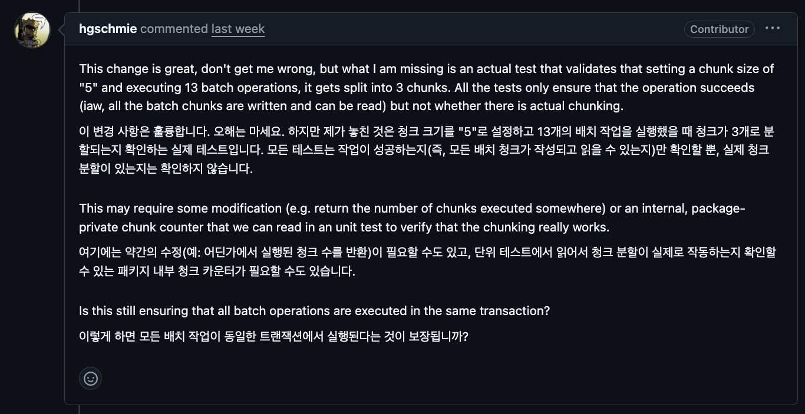
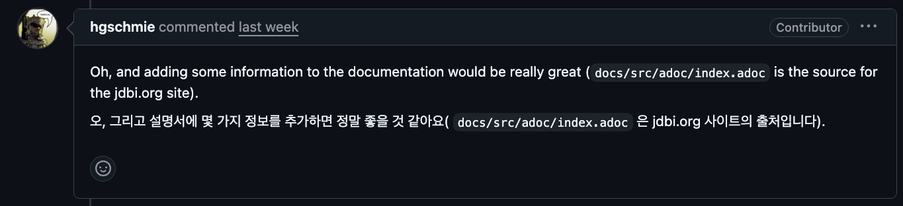

# 7주차

<aside>
📎 jdbi PR 리뷰에 대한 수정사항 반영

https://github.com/jdbi/jdbi/pull/2818

</aside>

### 이전까지 진행 내용

Add batch chunk size support to PreparedBatch by jang-namu · Pull Request #2818 · jdbi/jdbi 가져오기 완료
github.com

이 GitHub Pull Request의 진행 내용을 정리하면 다음과 같습니다:

## **PR 개요**

**제목**: Add batch chunk size support to PreparedBatch

**작성자**: jang-namu

**목적**: JDBI의 PreparedBatch에 배치 청크 크기 지원 기능 추가

## **주요 변경사항**

### **1. 핵심 기능 구현**

- **batchChunkSize 필드 추가**: 배치를 여러 청크로 나누어 실행할 수 있는 기능
- **getter/setter 메서드**: `getBatchChunkSize()`, `setBatchChunkSize()` 추가
- **청크 실행 로직**: `internalBatchExecute()` 메서드를 수정하여 큰 배치를 작은 단위로 분할 실행

### **2. 테스트 코드 작성**

- 기본값 검증 테스트
- 유효하지 않은 값(0, 음수) 검증 테스트
- 다양한 배치 실행 시나리오 테스트

## **리뷰 과정**

### **1. stevenschlansker의 승인 및 피드백 (6월 10일)**

- **승인**: 기본적인 구현에 대해 승인
- **성능 개선 제안**: 배열을 반복적으로 복사하는 것보다 효율적인 방법 제안
    - 방법 1: 미리 전체 크기로 배열 할당
    - 방법 2: ArrayList를 사용하여 마지막에 한 번만 조합

### **2. 개발자의 개선 (6월 11일)**

- stevenschlansker의 제안 중 방법 2를 채택
- ArrayList를 사용하여 성능 최적화 구현

### **3. GitHub Copilot AI 리뷰 (6월 15일)**

- **전반적 평가**: 긍정적
- **세부 제안**:
    - 예외 테스트에서 `assertThrows` 사용 권장
    - `beforeExecution()` 호출 패턴에 대한 검토 제안

### **4. hgschmie의 변경 요청 (6월 15일)**

- **코드 스타일**: AssertJ 체이닝 개선 요청 ✅
- **리소스 관리**: try-with-resources 블록 사용 권장 → 확인 필요 ❓
- **테스트 보완**: 실제 청킹이 동작하는지 검증하는 테스트 추가 필요 → 설계 생각중 🔍
- **문서화**: 기능에 대한 문서 추가 요청 → 테스트까지 수정 후 AI로 초안쓰자..
- **트랜잭션**: 모든 배치 작업이 동일한 트랜잭션에서 실행되는지 확인 필요 → 토론 필요 🗣️

## **현재 상태**

- **승인**: 1명 승인 (stevenschlansker)
- **변경 요청**: 1명 (hgschmie)
- **대기 중**: hgschmie가 제기한 이슈들에 대한 개발자의 추가 수정 작업 필요

이 PR은 대용량 배치 작업의 메모리 사용량을 최적화하는 유용한 기능을 추가하는 것으로, 기본 구현은 완료되었지만 코드 품질과 테스트 보완을 위한 추가 작업이 필요한 상황입니다.

## 메모

- [x]  테스트 수정 (Formatter, Chaining)
- [ ]  Chunk 실제 실행 횟수 테스트 (Counting)
- [ ]  트랜잭션 보장
- [ ]  Docs에 관련 설명 추가