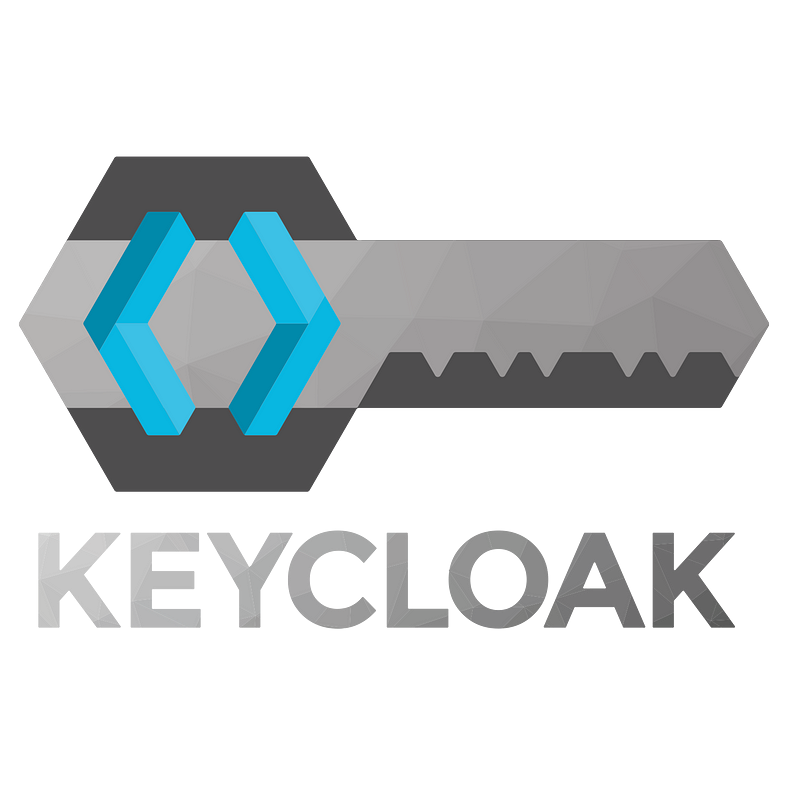

# KeyCloak 이란

- Red Hat에서 개발한 오픈소스 Identity and Access Management(IAM) 솔루션.
- 현대적인 애플리케이션과 서비스를 위한 인증 및 권한 부여 기능을 제공하는 인증 서버(Authentication Server)의 기능을 수행.
- CNCF의 Incubating 프로젝트로 선정.

# KeyCloak의 동작

- 어플리케이션은 Keycloak 서버를 통해 인증되도록 설정되며, Keycloak은 OpenID Connect 또는 SAML 2.0과 같은 오픈 프로토콜 표준을 이용하여 엑세스 권한을 부여.
- 어플리케이션은 사용자의 브라우저를 Keycloak 인증 서버로 리디렉션시키고, 사용자는 그곳에서 자격 증명을 입력.
- 해당 리디렉션에서 어플리케이션이 사용자의 자격 증명을 직접 다루지 않더라도 인증하도록 해줌.
- 어플리케이션은 대신 암호화 서명된 ID 토큰을 받습니다. 이 토큰에는 사용자 이름, 이메일, 주소 등과 같은 신원 정보뿐만 아니라 권한 정보도 담겨 있어 애플리케이션이 접근 제어를 판단.
- REST 기반 서비스 호출 시에도 토큰 사용 가능.

# KeyCloak Realm, Client, User

- Keycloak은 여러 개의 Realm을 지원. 해당 Realm들은 Master Realm이 관리
- 각 Realm은 여러 명의 사용자와 클라이언트(Application)을 가질 수 있습니다.
- 같은 Realm에 등록된 다른 애플리케이션(클라이언트)에서는 다시 로그인하지 않아도 바로 접근 가능.

### Realm
- Realm은 사용자, 인증, 인가, 권한, 그룹이 관리하는 범위.
- 한 Realm내의 Client들은 서로 SSO를 공유.
- 처음 Keycloak에 접속하면 Master Realm이 있는데, 이 Realm은 다른 Realm을 관리하는데 사용.

### Client
- Client란 인증, 인가 업무를 Keycloak에게 요청할 수 있는 주로 어플리케이션이나 서비스를 뜻함.

- 카카오톡이라는 Realm 안에서는 메일, 캘린더, 서랍, 이모티콘과 같은 Client(Application)에 접근이 가능.
    - SSO가 가능한 이유!!!

### User
- Client(Application)를 이용하는 사용자.
- 사용자는 Realm단위로 구분
- A라는 Realm에 가입된 X라는 사용자는 Client들에서 X의 아이디 하나로 로그인이 가능하지만, B라는 Realm에는 가입이 되어있지 않으므로 로그인이 불가능.

## 다른 예제

- 이 그림 안에서도 Hero Corp 라는 Realm 안에 Mobile, Frontend, Backend와 같은 Client(Application)을 등록 시킴.
- 또한 2개의 Realm이 존재하고, 각 Realm은 사용자(User), 그룹(Group), 역할(Role)을 가질 수 있음.

# Keycloak의 인증/인가
### 인증 (Authentication)
- 사용자가 아이디와 비밀번호 등을 입력하면 Keycloak은 이를 검증한 후 ID Token 및 Access Token을 발급합니다.
- 이 토큰에는 사용자의 고유 정보(예: ID, 이메일, 속성 등)가 담기며, 클라이언트 애플리케이션은 이 토큰을 이용해 사용자를 식별하고 SSO를 구현할 수 있음.
- User가 한 번 로그인하면, 같은 Realm에 속한 여러 Client(Application)에서 별도의 로그인 없이 접근이 가능.
    - 이는 Keycloak이 Realm 단위로 SSO 세션을 공유하기 때문

### 인가 (Authorization)
- 인가는 사용자가 특정 애플리케이션에 접근할 수 있는 권한이 있는지를 판단하는 과정.
- Keycloak에서는 User에게 각 Client(Application) 별로 Role을 부여.
- 단순히 로그인(인증)만 되었다고 해서 모든 기능을 사용할 수 있는 것이 아니며, 인가 설정이 되어 있지 않으면 토큰은 있어도 403 Forbidden이 발생할 수 있음.