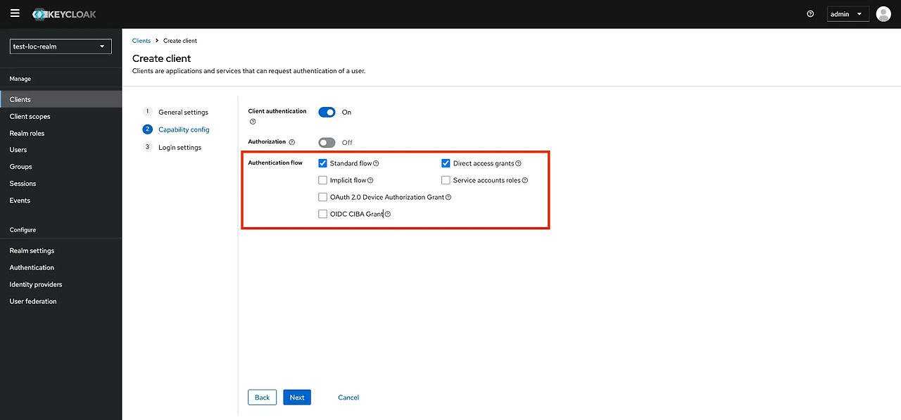

# Authentication Protocol

- **인증 프로토콜**은 사용자의 신원을 확인하기 위한 표준화된 통신 규약.
- Keycloak에서는 대표적으로 **OIDC(OpenID Connect)**와 **SAML(Security Assertion Markup Language)** 두 가지 인증 프로토콜을 지원.

---

## OIDC (OpenID Connect)

- OAuth 2.0을 기반으로 한 현대적인 인증/인가 프로토콜
- JWT(JSON Web Token)을 사용하여 ID 토큰과 Access 토큰 발급
- 주로 웹/모바일 애플리케이션에서 널리 사용됨
- HTML5, JavaScript 앱에 적합하고 구현이 상대적으로 쉬움

### OIDC의 Authentication Flow : Standard flow

Keycloak은 OIDC 환경에서 Identity Provider(IdP)로만 동작

> **OAuth 2.0의 Authorization Code Flow를 기반으로 하는 가장 일반적이고 안전한 인증 방식으로, 주로 브라우저 기반 웹 애플리케이션에서 사용.**
> 

1. 사용자가 브라우저를 통해 애플리케이션에 접근
2. 애플리케이션은 사용자가 로그인되지 않았음을 감지하고 Keycloak으로 리디렉션
3. 리디렉션 요청에는 인증 성공 시 돌아올 콜백 URL이 포함됨
4. Keycloak은 사용자를 인증하고, 임시 인증 코드를 발급
5. 인증 코드가 콜백 URL의 쿼리 파라미터로 애플리케이션에 전달됨
6. 애플리케이션은 해당 코드를 이용해 ID/Access/Refresh 토큰을 백그라운드에서 요청

---

## SAML (Security Assertion Markup Language)

- XML 기반의 개방형 표준 데이터 포맷으로 사용자의 인증 및 인가 데이터를 교환하기 위한 프로토콜
- 주로 엔터프라이즈 환경 및 레거시 시스템과의 연동에 많이 사용
- 사용자 정보와 인증 결과는 SAML Assertion이라는 XML 문서로 전달되며, 이 문서는 서명과 암호화를 통해 보호

### SAML의 Authentication Flow

SAML 프로토콜을 이용하는 경우 Keycloak은 2가지의 역할을 부여 받을 수 있음.

- **Identity Provider (IdP)**: 사용자 신원을 저장하고 인증하는 서비스.
- **Service Provider (SP)**: 사용자에게 서비스를 제공하는 웹 또는 서비스.

**1. Keycloak이 신원 제공자(Idp, Identity Provider) 역할을 수행하는 경우**

---

- Keycloak은 사용자의 신원 확인 주체로서 동작
- 사용자는 AWS IAM(SP)에 직접 접속하려고 하지만, 해당 서비스(SP)는 인증 처리를 Keycloak(IdP)에 위임합니다.
    - 따라서 사용자는 AWS IAM 페이지(SP)에 접근하면 Keycloak(IdP)으로 리다이렉션 됨.

**2. Keycloak 서비스 제공자(SP, Service Provider) 역할을 수행하는 경우**

---

- 외부 인증 시스템(예: 사내 통합 SSO, Active Directory 기반 IdP 등)에 인증을 위임
- 사용자가 Keycloak에 접근하면, Keycloak은 자체 인증을 하지 않고 외부 IdP로 인증을 넘김.
    - 따라서 사용자는 Keycloak(SP)으로 접근을 시도하면, 해당 Keycloak에서는 외부 SSO 시스템(IdP) 로그인 페이지로 리다이렉션 됨.

---

# Github Code 분석 및 Issue 찾기

### 선정한 Github Issue

**Can't logout when custom attributes added to the ID Token #39928**

**Describe the bug**

`keycloak-quickstarts`의 `js/spa` 예시 프로젝트에서 Realm에 속한 User의 속성 2개를 추가했을때, 해당 User의 **속성이 ID Token에 포함되어 있을 때 로그아웃 시 오류가 발생.**

### 선정 이유

1. 문제 상황을 테스트 할 수 있게 환경 구성하기가 쉽다.
2. 로그아웃과 관련된 처리 로직을 이해하고 공부할 수 있는 기회
3. 비교적 명확한 문제 상황과 로그 메시지, 문제 발생 위치 추정이 가능

## “GPT와의 대화”

1. OIDC 로그아웃 처리

- 경로:
    
    `services/src/main/java/org/keycloak/protocol/oidc/endpoints/LogoutEndpoint.java`
    
- 이유:
    
    로그아웃 URL(`/protocol/openid-connect/logout`)을 처리하는 **핵심 클래스**입니다.
    
    여기서 `id_token_hint` 파라미터를 받고, 토큰을 검증하고, 세션을 종료하는 로직이 포함되어 있습니다.
    

---

2. ID Token 파싱 및 검증

- 경로:
    
    `services/src/main/java/org/keycloak/token/TokenVerifier.java`
    
- 이유:
    
    `id_token_hint`를 **검증하거나 파싱할 때 실패**하는 경우가 많기 때문에,
    
    사용자 속성(attribute)을 포함한 ID Token이 파싱 도중 실패할 가능성도 이 클래스에서 확인해야 합니다.
    

---

3. 사용자 속성을 토큰에 추가하는 로직

- 경로:
    
    `services/src/main/java/org/keycloak/protocol/oidc/mappers/UserAttributeMapper.java`
    
- 이유:
    
    사용자의 custom attribute를 **ID Token이나 Access Token에 포함시키는 Mapper 로직**이 여기 구현되어 있습니다.
    

---

### 디버깅을 위한 흐름 요약

1. 사용자가 로그인하고 ID Token에 사용자 속성(attribute)이 포함됨
2. 로그아웃 시 `id_token_hint=<해당 ID 토큰>`을 포함해 요청됨
3. `LogoutEndpoint.java`에서 해당 토큰을 파싱 → `TokenVerifier`에서 검증 실패 발생 가능
4. 토큰 내용에 **형식 오류 / 예상치 못한 필드 구조**가 있을 수 있음 → 실패 시 예외 발생