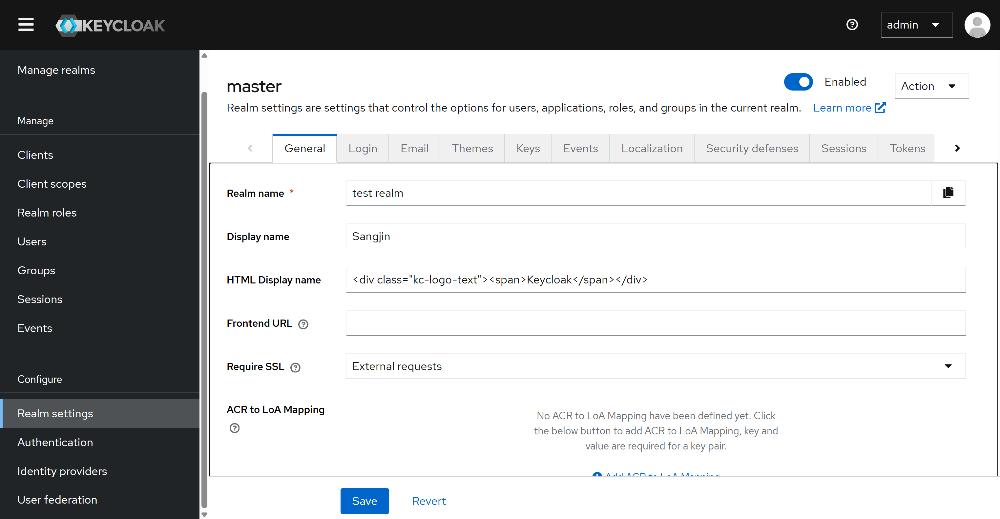

# 실습 환경 구성 및 오류 재현
- Keycloak 실습 환경을 구성하고, Realm 및 Client, Role을 생성하 환경을 구성
    
    
    

## 오류 재현

- Sangjin이라는 Client 생성

- sangjin이라는 Client에 대해 Dedicated Scope(해당 Client만을 위한 정보 접근 권한)를 설정하고, User Attribute 타입의 사용자 속성을 추가

- 설정 이후 로그아웃 과정에서 기존 Github Issue에서 언급했던 오류가 발생하는것 까지 확인했습니다… ㅎㅎ…

