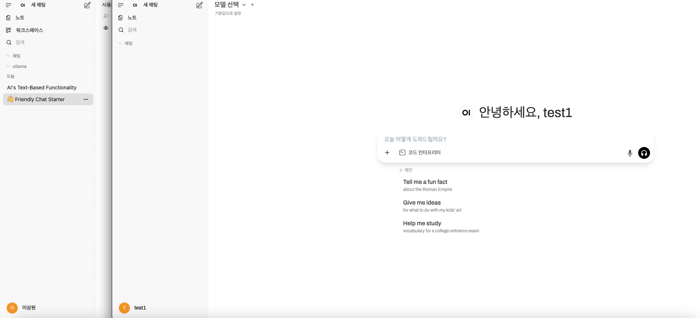

# week 2 분석 내용

자세한 다큐멘터리는 아래 url 을 참고해주세요~!

[open web ui documents](https://docs.openwebui.com/)

## opne web ui 설치 및 사용법

제일 쉬운 방법 

1. 도커 이용한 설치 방법
```docker
# pull 받기
docker pull ghcr.io/open-webui/open-webui:main

# run 하기
docker run -d -p 3000:8080 -v open-webui:/app/backend/data --name open-webui ghcr.io/open-webui/open-webui:main
```
2. 파이썬 이용하기 (의존성 문제 겪기 싫다면 가상환경 만들고 할 것)
```python
# 설치
!pip install open-webui

# 실행
open-webui serve
```


## 이번 주 진행한 사항

1. 집에서 도커를 통해 설치 

2. GPT 모델과 ollama 를 이용하여 모델 연결 (ollama system url 이슈가 있어서 차주 해결 후 확인 예정)

3. 관리자와 유저 단위 사용자 제작 (세션 관리 확인해보고자 함)



## 뭔가 개선할 만한 부분?

1. 인증 인가 관련  <br>
만약 기업 엔터프라이즈에서 로그인 모듈을 붙힌다고 한다면? 
oauth token 관련 이슈가 있는 것으로 보임 [cf url](https://github.com/open-webui/open-webui/issues/13904)


2. 은근 RAG 이슈도 많아 보이는 데 확인이 필요함
