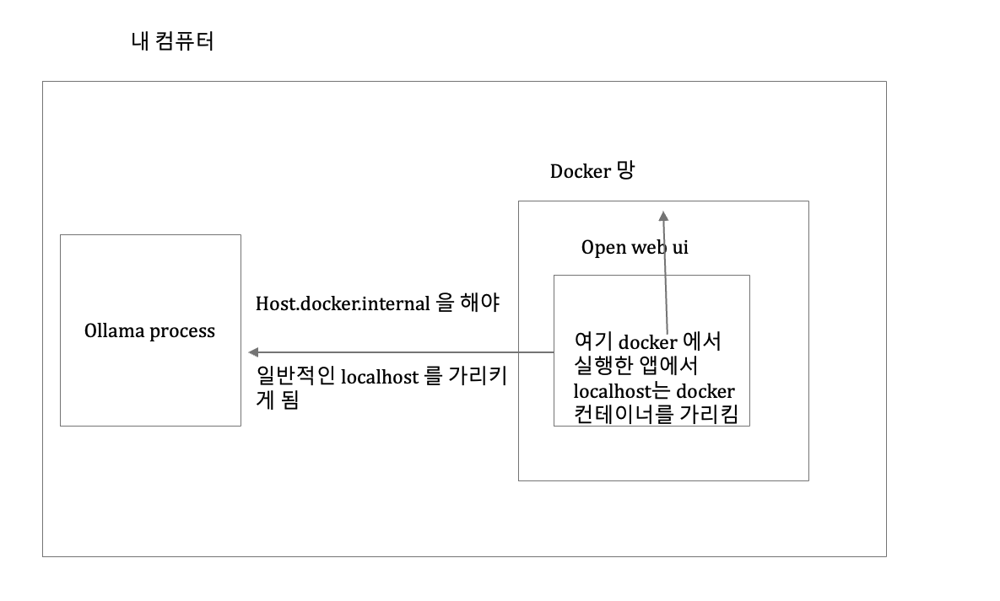

## week 3 

이번 주 진행 상황 공유
1. ollama 이슈 연결 성공
2. 그 이외 분석은... 회사 과제 및 회식등을 참석하니라 부득이 하게 못햇네요...

이번 주에 했던 사내 과제 공유
https://github.com/97tkddnjs/ai-agent/tree/main

1번 이슈 발생 이유
아래 사진 처럼 docker 를 통해서 openweb ui를 쓰게 되면 이런 이슈가 있다고 하더군요 참고 자료로 같이 동봉합니다...

차주 진행할 사항 
1. 어지간한 간단 기능들은 체크를 해봄 이제 현재 문제점인 issue와 pr을 분석해보려고 함

아래 이슈의 경우 ux를 저해하는 요소에 대해서 설명하고 있어서 한번 시도해볼 만하지 않나 하는 생각임

https://github.com/open-webui/open-webui/issues/13070

2. 소스 코드 자체를 clone 해서 확인을 해볼 필요 차주에 클론 후 로컬 구동을 해볼 예정
