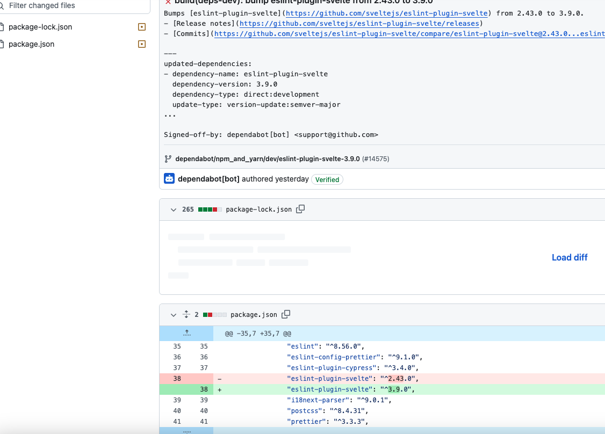

## week 3 

이번 주 진행 상황 공유 open web ui 를 담당하는 분이 다른 분이 된 후로 별로 보지 않게 되더군요 ㅜㅜ 
그치만 배운점... 오픈 소스 기여는 매우 쉬울 수 있다 아래 사진 처럼 버전업만 해도 된다는 것을 배웠습니다...
뭔가 코딩에 이용하고 직접 많이 쓰질 않다 보니 뭔가를 개선해야할 지 모르겠네요

최근 그래도 많이 본 라이브러리

langchain 
langgraph

고민 지점 

그래도 유저로 많이 사용하는
continue dev 를 탐구해볼까 하는 생각이 조금 있네요 (하지만 무료 버전만 써서...)

https://github.com/continuedev/continue/issues

의외로 최근... lang chain을 직접 쓰다 보니 핫한 langchain 에 기여해볼 수 있지 않을까 싶은 생각이 드네요 중구 난방의 오픈 소스...기여기...

